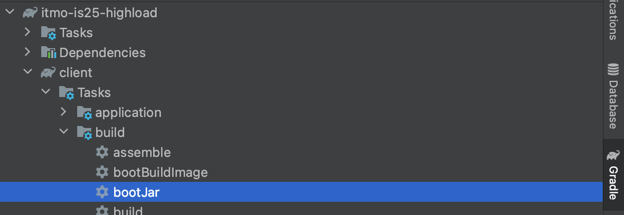
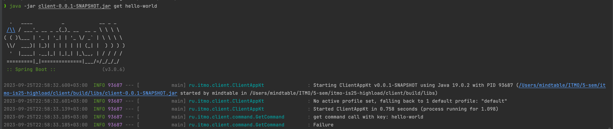

## Build

Run `itmo-is25-highload:client:bootJar` command

## Usage

Run `client/build/libs/java -jar client-0.0.1-SNAPSHOT.jar get <key>` command

## Useful links

[PicoCLI Documentation](https://picocli.info/#_spring_boot_example)